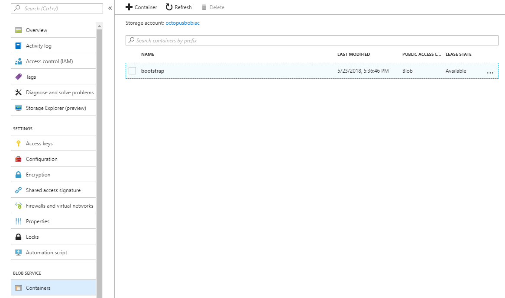
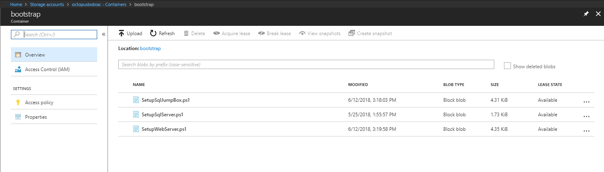
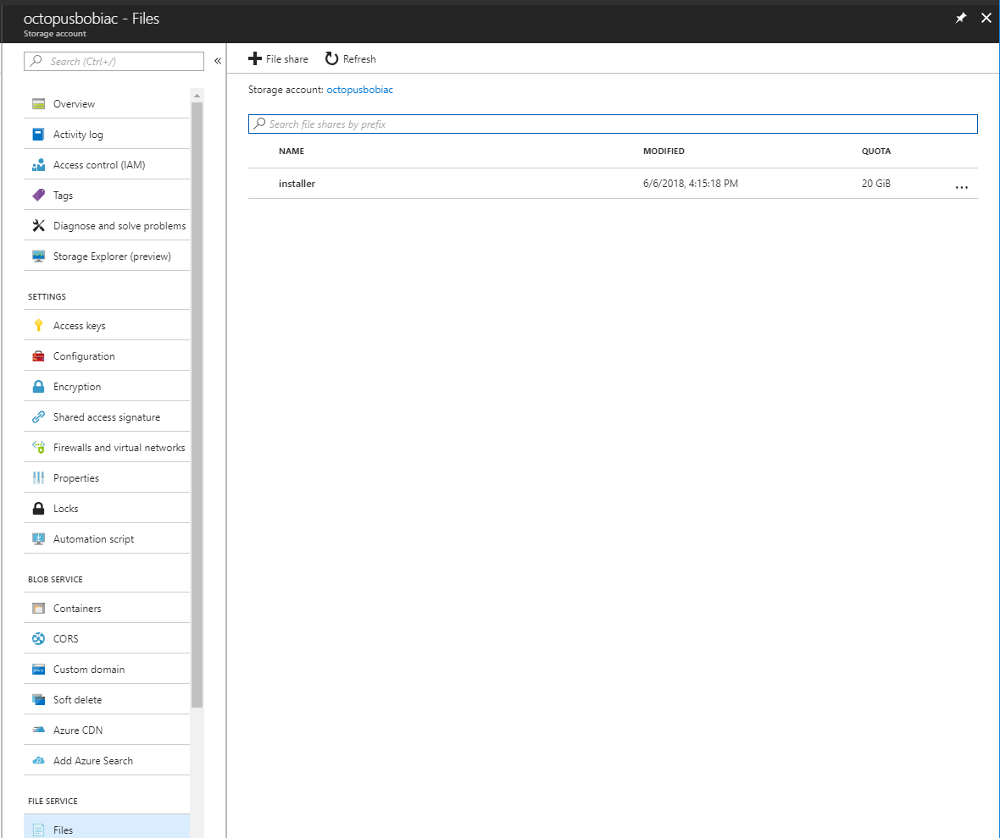
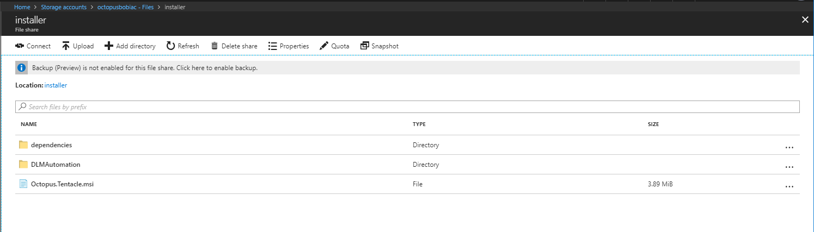
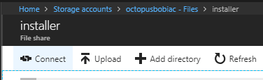
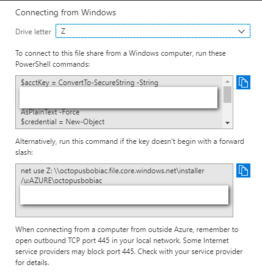

# IacDemo
 Contains all the files for the Infrastructure as Code Demo.

## Azure

### Azure Bootstrap
To get started you will need two items.  A pre-existing virtual network and a storage account to store the bootstrap scripts and MSIs to install on the servers.  To help out an ARM template is stored in this repository in the Azure / ArmTemplates folder there is a file called "PreExistingResourceGroup.json."  

The storage account should have a container called "bootstrap." 

That container should contain all the bootstrap PowerShell files.

The storage account should also have a file share called "installer."

The zip files in the folder "AdditionalSoftware" should be extracted to that share.

You can connect that file share as a network share by clicking on the connect button.

Clicking that button will provide you the necessary scripts to do that.

Make note of the account key.  That needs to be passed into the Azure Resource Template.

### Azure Resource Template Variables
In addition to the ARM template variables you will need to define the following variables which Octopus will automatically replace using OctoStache.

- Global.Database.AdminUser
- Global.Database.AdminPassword
- Global.Octopus.Url 
- Global.Octopus.ApiKey
- Global.Octopus.ServerThumbprint
- Octopus.Environment.Name 
- Project.Role.Web.Name 
- Project.Web.VM.Name
- Azure.Installers.Share.Key
- Azure.Installers.Share.Name

## Further Reading

- Adding Azure Account: https://octopus.com/docs/infrastructure/azure/creating-an-azure-account/creating-an-azure-service-principal-account
- Transient Environments: https://octopus.com/docs/deployment-patterns/elastic-and-transient-environments